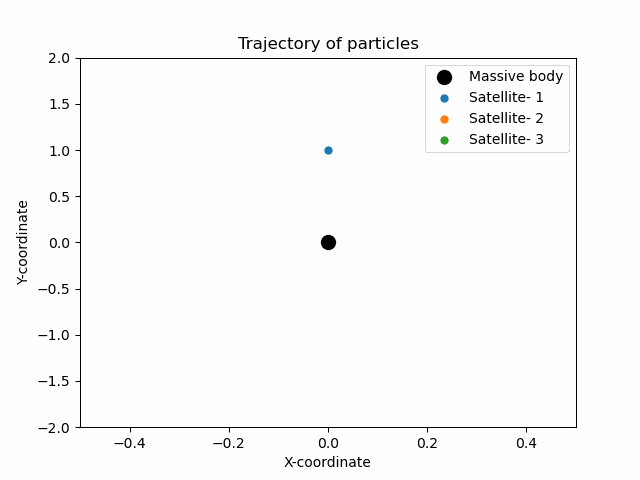

# N-Body Simulation

Python code for simulating the gravitational interactions between celestial objects using numerical methods and Newton's laws of motion.

## Table of Contents

- [Introduction](#introduction)
- [Installation](#installation)
- [Usage](#usage)
- [Contributing](#contributing)
- [License](#license)

## Introduction

The N-Body Simulation is a Python code that models the gravitational interactions between celestial bodies, such as planets or stars, using numerical methods. It applies Newton's laws of motion to calculate the displacements and trajectories of the particles over time.

## Installation

1. Clone the repository:
git clone https://github.com/arpmay/N-body-Problem.git

2. Install the required dependencies:
pip install numpy matplotlib

## Usage

1. Set the simulation parameters in the code:
- `k`: Number of bodies
- `G`: Universal Gravitational constant
- `dt`: Timestep in seconds
- `total_time`: Total simulation time

2. Specify the initial positions, velocities, and masses of the particles in the code.

3. Run the simulation:
python main.py

4. Visualize the trajectories of the particles using the provided 3D plot or animation (uncomment the code in `main.py`).

## Example

The animation below showcases an example simulation involving four bodies. The simulation consists of one massive central body and three satellite bodies orbiting around it under the influence of gravitational forces. 

## Contributing

Contributions are welcome! If you would like to contribute to this project, please fork the repository, make your changes, and submit a pull request.

## License

This project is licensed under the [MIT License](LICENSE).

